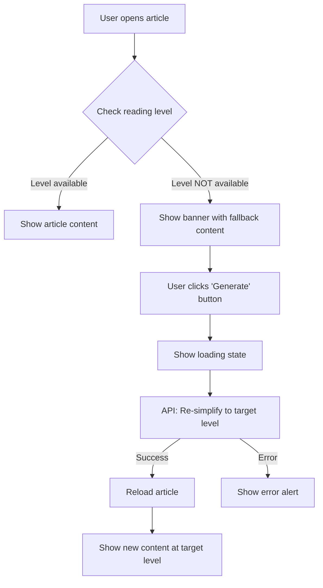

# 🔄 Re-Simplify Feature

## Overview
Fitur untuk mengubah reading level artikel yang sudah di-simplify ke level yang berbeda.

## Problem yang Diselesaikan

**Before:**
```
User preference: STUDENT level
Article available: EXPERT level only
Result: User harus baca EXPERT level (terlalu sulit)
```

**After:**
```
User preference: STUDENT level
Article available: EXPERT level only
Action: User klik "Generate STUDENT" button
Result: Article di-simplify ulang ke STUDENT level ✅
```

## Implementasi

### 1. Backend API Endpoint

```
POST /api/v1/simplify/{articleId}/resimplify
Body: { "readingLevel": "STUDENT" }
```

**Request:**
```json
{
  "readingLevel": "STUDENT"
}
```

**Response:**
```json
{
  "success": true,
  "data": {
    "articleId": "abc-123",
    "isNewSimplification": true,
    "content": [...],
    "metadata": {
      "readingLevel": "STUDENT",
      "processingTime": 25000
    }
  }
}
```

### 2. Frontend Implementation

#### Files Created/Modified:

**✅ [services/simplifyApi.ts](../services/simplifyApi.ts#L284-L314)**
- Added `resimplifyArticle()` function
- Exported as `simplifyApi.resimplify()`

**✅ [hooks/useResimplify.ts](../hooks/useResimplify.ts)** (NEW)
- Custom hook for re-simplify workflow
- Handles loading states & errors
- Returns `{ resimplify, isResimplifying, progress }`

**✅ [constants/readingLevels.ts](../constants/readingLevels.ts)**
- Added conversion helpers:
  - `toAPIReadingLevel()` - UI → API
  - `fromAPIReadingLevel()` - API → UI

**✅ [app/article/[slug].tsx](../app/article/[slug].tsx#L309-L349)**
- Added reading level mismatch detection
- Added banner UI for re-simplify
- Auto-reload article after re-simplify

### 3. UI Components

#### Reading Level Mismatch Banner

Muncul ketika:
- User preference: STUDENT
- Article only has: EXPERT

Banner shows:
```
ℹ️ Student level not available
   Currently showing EXPERT level.

   [Generate Student]  ← Button
```

#### Loading State

Saat re-simplifying:
```
⏳ Simplifying to STUDENT level...
   This may take 20-30 seconds...
```

## Usage Example

### From Article Page:

```typescript
import { useResimplify } from '@/hooks/useResimplify';

const { resimplify, isResimplifying, progress } = useResimplify();

const handleResimplify = async () => {
  const success = await resimplify(articleId, 'STUDENT');

  if (success) {
    // Reload article to get new content
    await fetchArticle();
  }
};
```

## User Flow



## API Details

### Reading Level Values

**Frontend (UI/Storage):** lowercase
- `'simple'`
- `'student'`
- `'academic'`
- `'expert'`

**Backend (API):** UPPERCASE enum
- `'SIMPLE'`
- `'STUDENT'`
- `'ACADEMIC'`
- `'EXPERT'`

**Conversion:**
```typescript
import { toAPIReadingLevel } from '@/constants/readingLevels';

const uiLevel = 'student'; // from UI
const apiLevel = toAPIReadingLevel(uiLevel); // 'STUDENT' for API
```

## Debug Logs

Ketika re-simplify triggered:

```
============================================================
[🔄 RESIMPLIFY] Starting re-simplify workflow
[🔄 RESIMPLIFY] Article ID: abc-123
[🔄 RESIMPLIFY] Target Level: STUDENT
[SimplifyAPI] Re-simplifying article: abc-123
[SimplifyAPI] Target reading level: STUDENT
[SimplifyAPI] Re-simplify response: 200
[🔄 RESIMPLIFY] Result: {
  "articleId": "abc-123",
  "isNewSimplification": true,
  "hasContent": true,
  "contentBlocks": 15
}
[✅ RESIMPLIFY] Success!
[RESIMPLIFY] Success! Reloading article...
============================================================
```

## Testing

### Manual Test:

1. **Setup:**
   - Set user reading level to STUDENT
   - Simplify a paper (will be EXPERT by default)

2. **Navigate to article:**
   - Should see banner: "Student level not available"
   - Should see button: "Generate Student"

3. **Click button:**
   - Should show loading state
   - Wait 20-30 seconds
   - Article should reload with STUDENT level

4. **Verify:**
   - Banner should disappear
   - Content should be at STUDENT level
   - No more "fallback" warning

### Backend Test:

```bash
# Test re-simplify endpoint
curl -X POST http://192.168.1.53:5000/api/v1/simplify/abc-123/resimplify \
  -H "Content-Type: application/json" \
  -H "Authorization: Bearer YOUR_TOKEN" \
  -d '{"readingLevel": "STUDENT"}'
```

## Benefits

✅ **User Experience:**
- Users get content at their preferred level
- No need to manually search for different versions
- One-click solution

✅ **Flexibility:**
- Can re-simplify to any level
- Works with external papers (Scholar, OpenAlex)
- Cached for future requests

✅ **Smart Detection:**
- Auto-detects level mismatch
- Shows clear message to user
- Fallback to available level while waiting

## Future Improvements

1. **Pre-generate multiple levels:**
   - When simplifying, create STUDENT + ACADEMIC levels
   - Reduces wait time for users

2. **Background processing:**
   - Queue re-simplify requests
   - Notify user when done

3. **Level switcher:**
   - Dropdown to switch between available levels
   - Show which levels are available

4. **Progress indicator:**
   - Show percentage complete
   - Estimated time remaining

---

**Created:** 2025-12-04
**Last Updated:** 2025-12-04
**Status:** ✅ Implemented & Ready to Test
