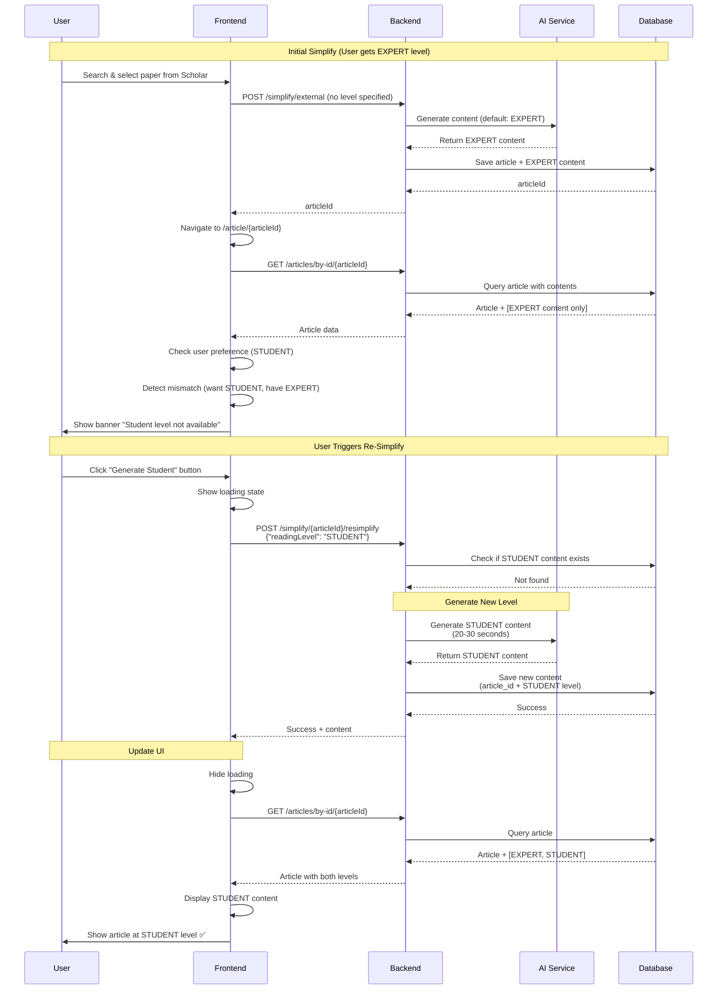
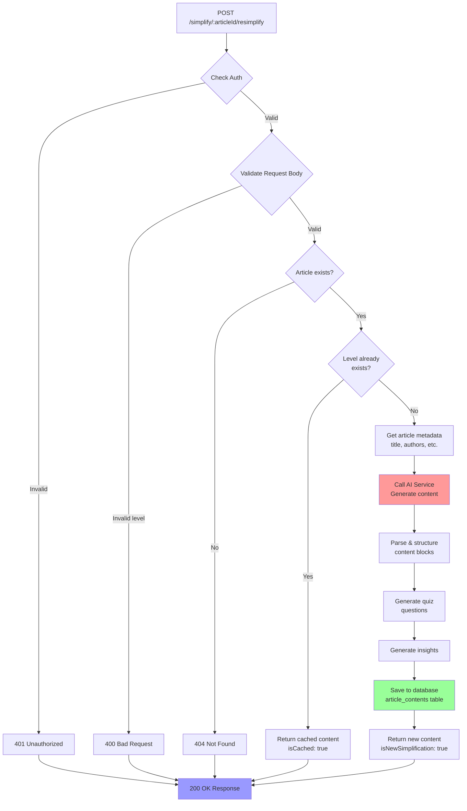
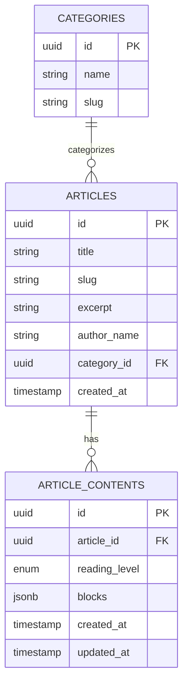
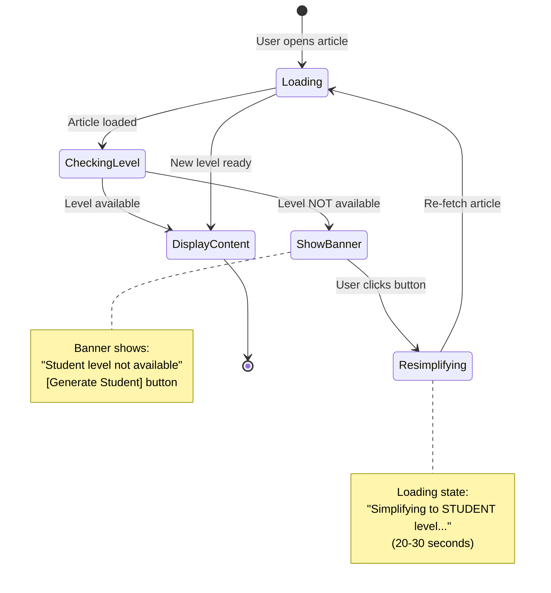
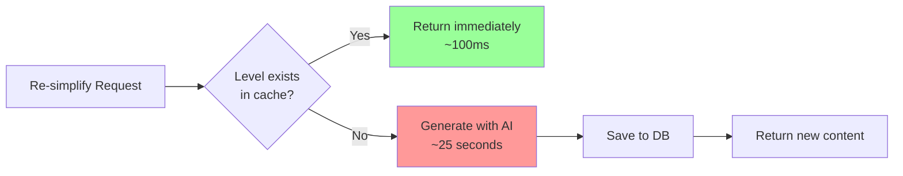
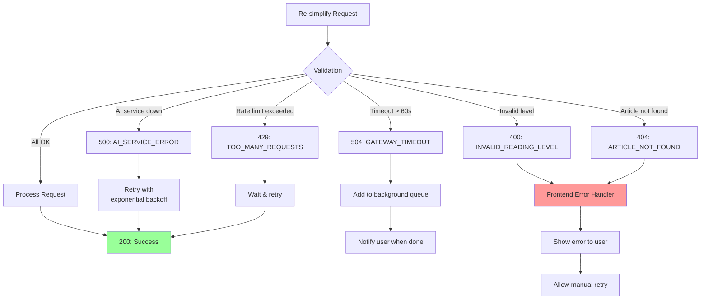

# 🔄 Re-Simplify Flow Diagram

Visual flow untuk memahami bagaimana re-simplify feature bekerja dari frontend ke backend.

---

## 1. User Journey Flow



---

## 2. Backend Logic Flow



---

## 3. Database Structure



**Key Constraints:**
- `UNIQUE(article_id, reading_level)` → Prevents duplicate levels
- `reading_level ENUM` → Only allows: SIMPLE, STUDENT, ACADEMIC, EXPERT

---

## 4. Frontend State Management



---

## 5. API Response Comparison

### Initial Simplify Response:
```json
{
  "data": {
    "articleId": "abc-123",
    "contents": [
      {
        "readingLevel": "EXPERT",
        "blocks": [...]
      }
    ]
  }
}
```
**Problem:** Only 1 level available ❌

### After Re-Simplify:
```json
{
  "data": {
    "articleId": "abc-123",
    "contents": [
      {
        "readingLevel": "EXPERT",
        "blocks": [...]
      },
      {
        "readingLevel": "STUDENT",
        "blocks": [...]
      }
    ]
  }
}
```
**Solution:** Multiple levels available ✅

---

## 6. Cache Strategy



**Benefits:**
- ✅ Fast for repeated requests (100ms vs 25s)
- ✅ Saves AI cost ($0.05 per generation)
- ✅ Consistent results

---

## 7. Error Handling Flow



---

## 8. Performance Metrics

### Target Metrics:
```
┌──────────────────────────────────────────────────┐
│ Metric                 │ Target    │ Acceptable  │
├──────────────────────────────────────────────────┤
│ New level generation   │ 20-25s    │ < 30s       │
│ Cached response        │ < 500ms   │ < 1s        │
│ Success rate           │ > 95%     │ > 90%       │
│ AI cost per request    │ $0.03-0.05│ < $0.10     │
│ Concurrent requests    │ 10-20     │ > 5         │
└──────────────────────────────────────────────────┘
```

### Monitoring Dashboard:
```
Re-Simplify Metrics (Last 24h)
─────────────────────────────────────
Total Requests:          127
  ├─ New generations:     45 (35%)
  ├─ Cached responses:    82 (65%)
  └─ Failed:               0 (0%)

Avg Response Time:      8.5s
  ├─ New:              24.2s
  └─ Cached:           0.3s

AI Cost:               $2.25
Success Rate:          100%
```

---

## 9. Deployment Checklist

```
┌─ Pre-Deployment ──────────────────────────────┐
│ ☐ Database migration executed                 │
│ ☐ Unique constraint added                     │
│ ☐ Index created                                │
│ ☐ API endpoints implemented                   │
│ ☐ Unit tests passed (>80% coverage)          │
│ ☐ Integration tests passed                    │
└───────────────────────────────────────────────┘

┌─ Staging Tests ───────────────────────────────┐
│ ☐ Test re-simplify to STUDENT                │
│ ☐ Test re-simplify to ACADEMIC               │
│ ☐ Test cached response                        │
│ ☐ Test error cases                            │
│ ☐ Performance test (< 30s)                   │
│ ☐ Load test (10 concurrent)                  │
└───────────────────────────────────────────────┘

┌─ Production Deployment ───────────────────────┐
│ ☐ Deploy to production                        │
│ ☐ Monitor error rate                          │
│ ☐ Monitor response time                       │
│ ☐ Monitor AI cost                             │
│ ☐ Enable frontend feature                     │
│ ☐ Document in API docs                        │
└───────────────────────────────────────────────┘
```

---

## 10. Example Scenarios

### Scenario 1: Happy Path
```
User (STUDENT preference)
  └─> Opens article (only EXPERT available)
      └─> Sees banner "Student level not available"
          └─> Clicks "Generate Student"
              └─> Waits 25 seconds
                  └─> Article reloads
                      └─> Shows STUDENT content ✅
```

### Scenario 2: Already Cached
```
User (STUDENT preference)
  └─> Opens article (has EXPERT + STUDENT)
      └─> Directly shows STUDENT content ✅
      └─> No banner shown
```

### Scenario 3: Network Error
```
User (STUDENT preference)
  └─> Opens article (only EXPERT available)
      └─> Clicks "Generate Student"
          └─> Network timeout after 60s ❌
              └─> Shows error alert
                  └─> Allows retry
                      └─> Success on retry ✅
```

---

**Last Updated:** 2025-12-04
**Related Docs:**
- [Full API Spec](./RESIMPLIFY_AND_ARTICLE_BY_ID_API.md)
- [Quick Summary](./QUICK_API_REQUEST_SUMMARY.md)
- [Test Examples](./API_TEST_EXAMPLES.sh)
